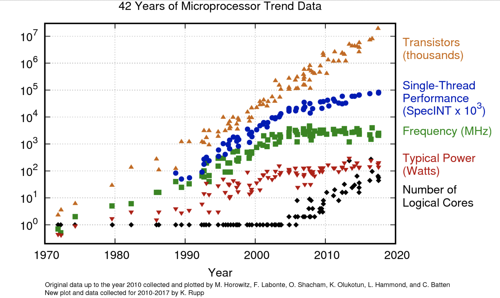
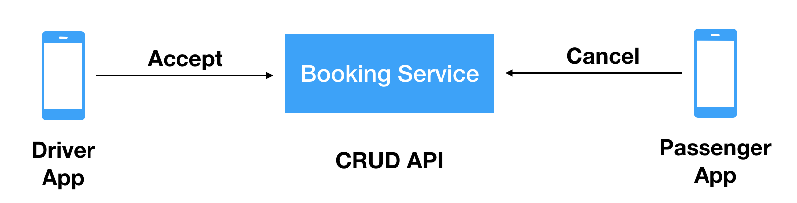
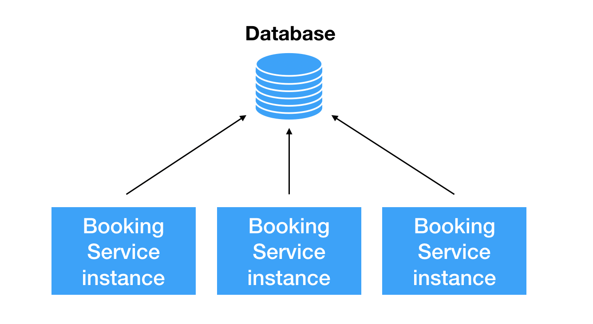

# Parallel processing on mutable state

## Why everyone do parallel processing now?

You may have noticed that processor clock speed is not changing over the last 15 years. When first mass multicore processors released prominent people [proclaimed](http://www.gotw.ca/publications/concurrency-ddj.htm) a turn toward concurrency in software development.



Single thread performance did improve (literally) 10x since then. But every modern software development team now will use parallel processing as the main weapon against throughput and latency issues.

This article is about common scenarios in service-oriented applications when parallel processing does not bring performance gains.

## The setting 

Consider this naive architecture of Uber-like ( [ride-hailing](https://en.wikipedia.org/wiki/Peer-to-peer_ridesharing) ) application.



* Booking Service is simple [CRUD](https://en.wikipedia.org/wiki/Create,_read,_update_and_delete) API which allows us to create and change the state of booking. Booking states are `created`, `accepted`, `canceled` and `completed`
* Passenger app allows us to create and cancel a booking. 
* Driver app allows the driver to accept and complete bookings.

## The goal

Our goal is to implement the following business requirements:
* bookings can be `canceled` after it was `accepted`
* bookings cannot be `accepted` after it was `canceled`

## Naive (stereotypical) solution

Driver app checks if booking state is `created` and then sends accepts it: 
* GET request to receive booking state
* if booking state `created` send `PUT` request to set the state to `accepted`

<table>
<tr><td>Driver App</td><tr>
<tr>
 <td><pre>GET /booking/{id}</pre></td>
<tr>
<tr>
 <td><pre>assert(state == 'created', true)</pre></td>
<tr>
<tr>
 <td><pre>PUT /booking/{id} {"state": "accepted"}</pre></td>
<tr>
</table>


The immediate problem is: what happens if Passenger App sent cancel request between `GET` and `PUT` in the Driver app. If Booking Service does no special checks, the last `PUT` request will override `canceled` state with `accepted` state. Which breaks our business requirement.

<table>
<tr><td>Driver App</td><td>Passenger App</td><tr>
<tr>
 <td><pre>GET /booking/{id} {"state": "created"}</pre></td>
 <td><pre>GET /booking/{id} {"state": "created"}</pre></td>
<tr>
<tr>
 <td></td>
 <td><pre>PUT /booking/{id} {"state": "canceled"}</pre></td>
<tr>
<tr>
 <td><pre>PUT /booking/{id} {"state": "accepted"}</pre></td>
 <td></td>
<tr>
<tr>
 <td><pre>GET /booking/{id} {"state": "accepted"}</pre></td>
 <td><pre>GET /booking/{id} {"state": "accepted"}</pre></td>
<tr>
</table>


The problem which occurs can be classified as as `read-modify-write` race condition. For many engineers, due to [Birthday Paradox](https://en.wikipedia.org/wiki/Birthday_problem) it can none intuitive how often this race condition will actually happen.

## Evolution of naive solution

The next obvious evolution of the app would be validating the previous state inside the Booking Service. Let's consider the following stereotypical architecture for booking service:



* for purposes of scalability and availability booking service running multiple instances.
* all instances share a single database

Now let's move our booking state validation from Driver App to booking service. When `PUT` request with state updates processed:
* booking service query database for the current state
* if a booking state is still `created`, update it

However, when at the same time cancellation request will hit another instance of Booking Service, we will end up with the same `read-modify-write` race condition.

The following solution evolution will depend on database application is using. In the case of PostgreSQL it may look like this:
* wrap queries with a transaction

It won't work either because PostgreSQL default transaction isolation level is [Read Committed](https://www.postgresql.org/docs/current/transaction-iso.html#XACT-READ-COMMITTED)

> note that two successive SELECT commands can see different data, even though they are within a single transaction if other transactions commit changes after the first SELECT starts and before the second SELECT starts.

<table>
<tr><td>Instance 1</td><td>Instance 2</td><tr>
<tr>
 <td><pre>BEGIN</pre></td>
 <td><pre>BEGIN</pre></td>
<tr>
<tr>
 <td><pre>SELECT * FROM bookings WHERE id=1</pre></td>
 <td><pre>SELECT * FROM bookings WHERE id=1</pre></td>
<tr>
<tr>
 <td></td>
 <td><pre>UPDATE bookings SET state='canceled' WHERE id=1</pre></td>
<tr>
<tr>
 <td><pre>UPDATE bookings SET state='accepted' WHERE id=1</pre></td>
 <td></td>
<tr>
<tr>
 <td><pre>COMMIT</pre></td>
 <td><pre>COMMIT</pre></td>
<tr>
</table>

The result will be still `accepted` and not `canceled`


## Root of all evil

All the solution iterations here fall into the same pattern: parallel processing on a mutable state.

The iterations may move the problem down the stack:
* from frontend to backend instances
* from backend instances to database threads

But they don't solve fundamental problems, which can be best described with this pseudo-equation:

```
Parallel processing + Mutable Processing = Nondeterminism
```

This is the best (but old) article I found on a matter, applied to Java threads: [Why shared mutable state is the root of all evil](http://henrikeichenhardt.blogspot.com/2013/06/why-shared-mutable-state-is-root-of-all.html
)

## Fixing a naive solution

The only right way to fix parallel processing on a mutable state is to NOT doing it. In other words, we need to establish some kind of synchronization and make the processing of mutable sequential.

In case of PostgreSQL database we can (ranging from slowest to fastest):
* use [row level locking](https://www.postgresql.org/docs/9.1/explicit-locking.html#LOCKING-ROWS)
* use [serialazable transactions](https://www.postgresql.org/docs/9.1/transaction-iso.html#XACT-SERIALIZABLE)
* implement [optimistic locking](https://en.wikipedia.org/wiki/Optimistic_concurrency_control)


One big problem with it can be described by [Amdahl's Law](https://en.wikipedia.org/wiki/Amdahl%27s_law)
> if just 10% of your program cannot be parallelized then with infinite parallel instances you cannot gain more then 10x performance over the single-thread performance.

On practice e.g. with 5 parallel threads performance gain will be ~3x (and not 5x). Whenever we introduce synchronization in this stereotypical architecture we kill possible speedup which parallel processing can bring.

## Bottom line 

If you have an entity in your system which can be modified by more then one actor (e.g. one booking modified by two users):
* within stereotypical architecture it is very easy to mistake and introduce non-determinism (e.g race conditions into the application
* race conditions appear much more often than intuition suggests ([Birthday Paradox](https://en.wikipedia.org/wiki/Birthday_problem)); it's very hard to reproduce them in development and testing
* you should design application in a way that all processing of mutable state is always synchronized (e.g happens single thread)
* the stereotypical architecture will fail to scale

If you want to make your system scaleable you need to look towards distributed locking/sharding (like [this example with Apache Kafka](https://danlebrero.com/2018/04/09/kafka-distributed-coordination-actor-model/)) or more sophisticated Actor Model

## Good Links

* 42 Years of Microprocessor Trend Data https://www.karlrupp.net/2018/02/42-years-of-microprocessor-trend-data/
* Why shared mutable state is the root of all evil http://henrikeichenhardt.blogspot.com/2013/06/why-shared-mutable-state-is-root-of-all.html
* Amdahl's law https://en.wikipedia.org/wiki/Amdahl%27s_law
* Birthday problem https://en.wikipedia.org/wiki/Birthday_problem
* Transaction Isolation in PostgreSQL https://www.postgresql.org/docs/current/transaction-iso.html
* PostgreSQL anti-patterns: read-modify-write cycles https://www.2ndquadrant.com/en/blog/postgresql-anti-patterns-read-modify-write-cycles/
* Kafka, distributed coordination https://danlebrero.com/2018/04/09/kafka-distributed-coordination-actor-model/

